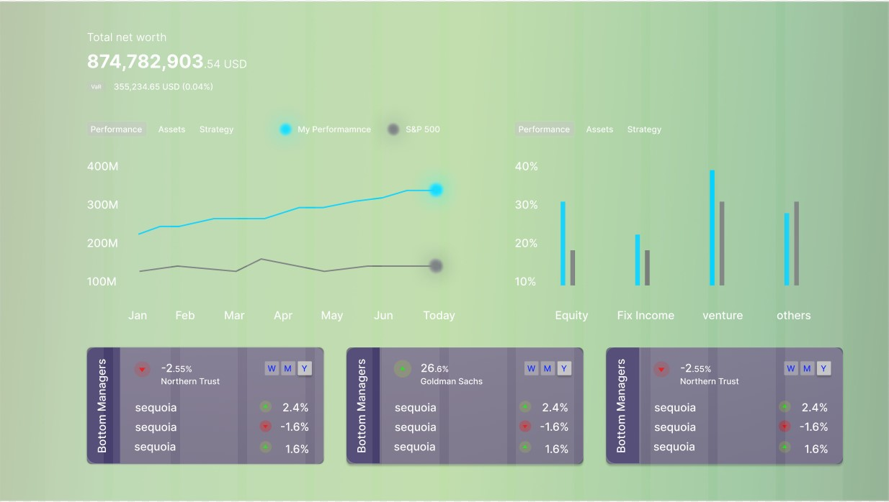

# React Stock Api App

## Description

A single page stock portfolio tracker built with React and Financial Modeling Prep's API, using react concepts of react components, passing/lifting states, api calls with axios, re-charts library for plotting data and react-tables hook for tabluar data.

### Technologies Used


```
- React
- Re-charts JS Library to Plot Data
- React-tables hook
- Axios for API calls
- Thunder Client to test API Calls
```

### Wireframes

Used figma to create a wireframe 



Although my final product looks different from the initial wireframe, the wireframe allowed me to think things through.

### User Stories

A story of the project user, that explains the use of the project.

```
Summary: Sam is a 24 year old who is just venturing into investing, he wants to gather a little information about a group of stocks that he is interested in. He wants a place where he can get all the customised information he needs conveniently.

User must be able to:

- Needs and Goals
Sam needs to be able to select stocks into a portfolio and get data for these stocks.

- Motivations
Sam wants to learn more about stocks so that he can invest in the future but doesn't want the inertia of too much time and effort invested.

- Pain Points
Sam does not want to google for each stock individually, does not have money for a paid subscription for investment portals.

- Activities
Sam is busy with work and school and loves to learn new things.

```

---

## Planning and Development Process

A basic story of your planning and developing this project.

1. Wanted to create an app that called a financial api, so I can learn more about these types of apis. 
2. Also wanted to learn how to plot data that being called from an api.

As a result, decided to create an app that makes use of these different features.

I created one main component for each view and explored each function I was interested in separately.
Then brought them together under different routes with the main states stored on the app level.

### Problem-Solving Strategy

What strategy did you use to solve your problems.
1. Breaking problems down into smaller tasks.
I made a component for each function of the app, e.g. one component for each type of graph, one component to make a certain api call, one component for forms input.
This allowed me to work on one feature/function of the app at a time, to isolate bugs and ensure that it is modular and easy to fix.

2. Most challenging problem: multiple api calls on a single render for different stocks
Was unable to update state of company info for multiple stocks which required multiple api calls, because setting state took time and only the latest api call data was updated. Learn how to use promises to assign all the required api calls to a list of promises before evaluating them together and updating them as a whole to state.

### Unsolved problems

List unsolved problems which would be fixed in future iterations.

1. Adding additonal api calls for other types of company info
- to create a more comprehensive view of porfolio performance by providing more information

2. Multiple tickers on the same chart
- To allow multiple stock tickers to be plotted on the same chart, to allow for better comparison

3. Making use of params to get custom pages for stocks
- to use params to create a unique page for each stock ticker searched

## APIs Used

List your APIs used in this project and why it was used:

All the APIs used are from a single source: Financial Modeling Prep here: https://site.financialmodelingprep.com/developer/docs

1. Short quote for single stock information
https://financialmodelingprep.com/api/v3/quote-short/AAPL

2. List of available tickers from nasdaq
https://financialmodelingprep.com/api/v3/nasdaq_constituent

3. Stock news
https://financialmodelingprep.com/api/v3/stock_news

4. Company info (key financial ratios)
https://financialmodelingprep.com/api/v3/ratios-ttm

---

## Acknowledgments

Michael and Seif-8 Instructors for guidance and advice on how to proceed.
---

 ## References